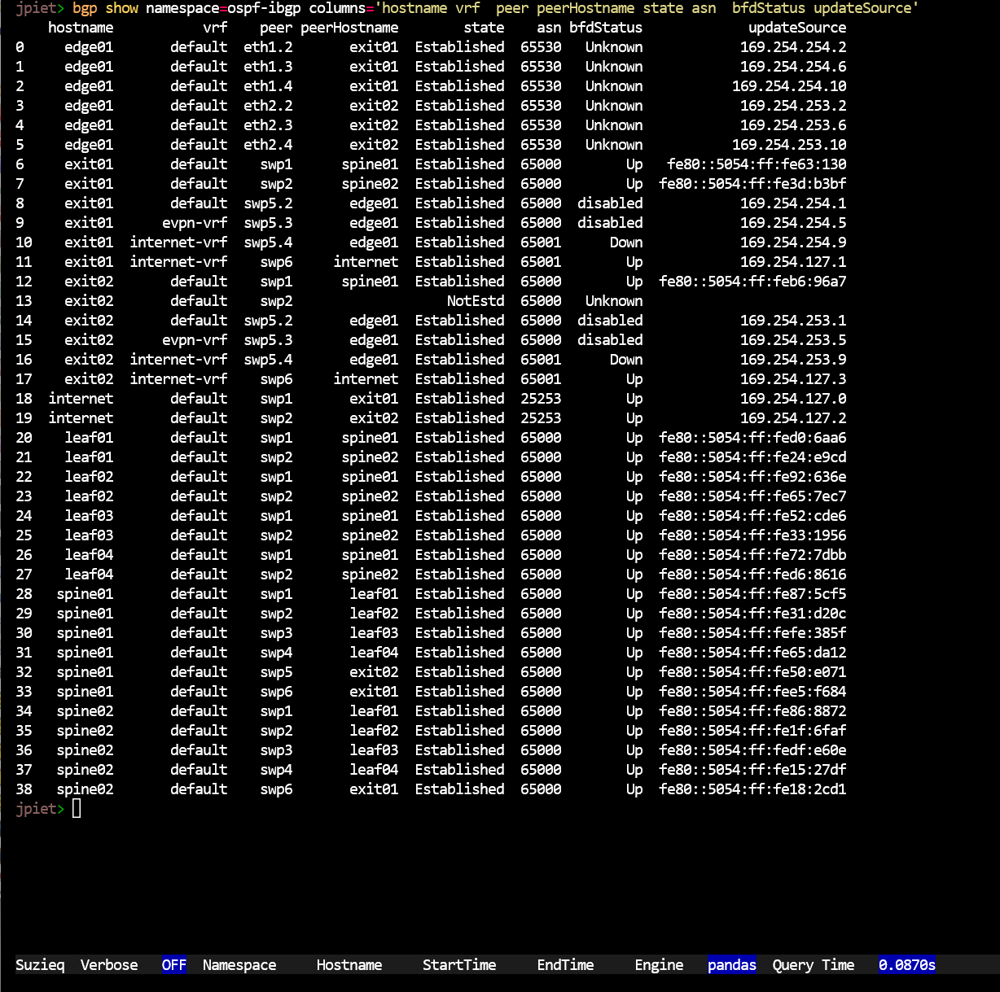
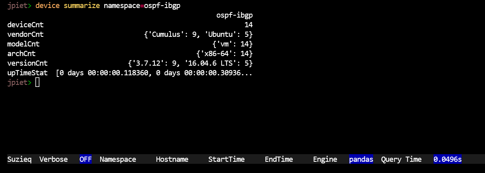
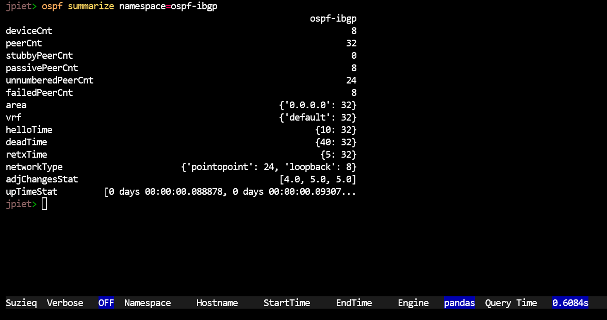
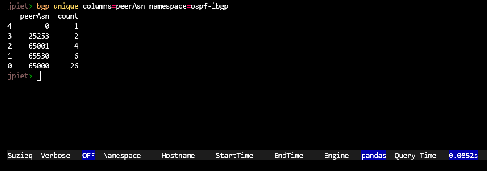
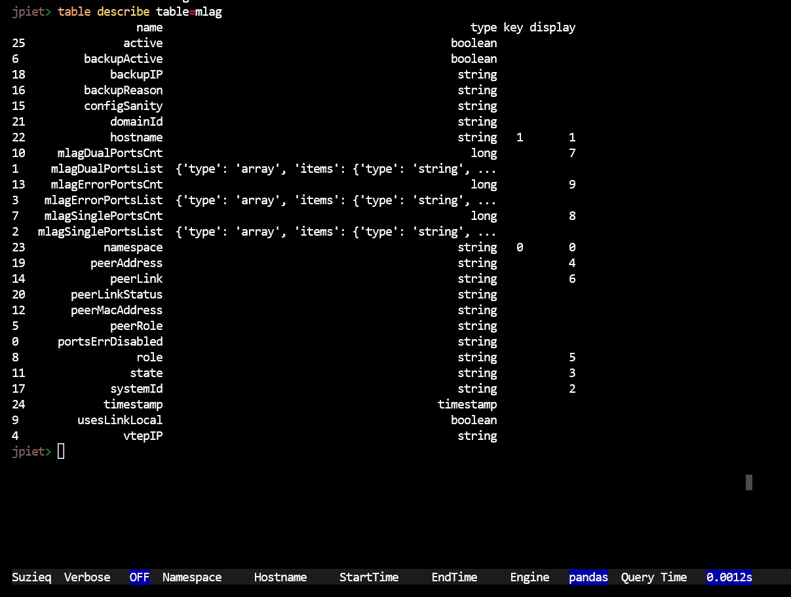

## How to reason about your network with Suzieq verbs

As we've mentioned in our [Introduction](index.html), the Suzieq cli has commands, verbs and 
filters. We are going to address verbs.

Almost every command has three common verbs: show, summarize, and unique. Another set of common
verbs are top and assert. Some commands have other verbs specific to them as well.


### show
Show is the most basic verb. Every command has a show verb. It will return the
most basic data for that command. Often there is a direct mapping from a service
to a command, and the show command will show data from that table.

The show verb, like the others, allows filtering. For show, the columns filter
is especially useful.

bgp show is a good examples. It gets it's data from a single table and it shows a limited number
of the columns available.
```
bgp show
```


Path show looks some different in that you have to provide more arguments for it to work. Path
displays the path between two endpoints so it requires a src and dest.
```
path show src='172.16.1.101' dest='172.16.4.104' namespace=dual-bgp
```


```
table show
```
Table show looks a bit differnt than the other commands, because table show is showing 
the tables in the database, not directly looking at data inside tables.
 

Some of the tables have a lot of columns. We have a standard set of default columns for
each table. However, you can add a columns= filter to add more columns or see less. columns=*
shows all the columns. This examples show looking at specific data by using columns= filter.
```
bgp show namespace=ospf-ibgp columns='hostname vrf peer peerHostname state asn bfdStatus updateSrource'
```


Some commands have specific filters. 
If you want to look at specific interface types, such as virtual interfaces
```bash
interface show namespace=ospf-ibgp hostname=leaf01 type='vxlan vrf vlan'
```


if you want to investigate why bgp sessions are failing
```
bgp show namespace=single-attach_bgp_numbered columns='namespace hostname vrf peer state reason notifcnReason lastDowTime'
```


### summarize
Summarize works through the data in the table and produces a summary of what Suzieq
thinks are the most important information.
```
device summarize namespace=ospf-ibgp
```


In any of our summaries, statistics that end with Cnt, such as vendorCnt, 
if there are three or less of them, then we break out the items and provide
their count. In this example, there are 2 vendorCnts, which are Cumulus 
and Ubuntu. Statistics that end with Stat, such as upTimesStat, shows 
lists of three items bracketed in [] show [min, max, median] of the values 
to give you an overview of the distribution. For any of these values, you 
can use the ‘unique’ verb to dive into the column and see the whole list.

```
ospf summarize namespace=ospf-ibgp
```


```
path summarize src='172.16.1.101' dest='172.16.4.104' namespace=dual-bgp
```


### unique
Unique takes a single column and produces the list of unique items and the count of
how many times that item occurs. unique does not work on the path command. unique
is very useful for diving in to understand the details of your network.



### assert
assert works on bgp, evpnVni, interface, and ospf. 
[asserts](https://github.com/netenglabs/suzieq/blob/master/docs/analyzer.md#asserts)
run checks that must be true for a network to be running correctly. For each 
service that has an assert you get an output that shows all the data 
necessary for the checks, a pass/fail column and a reason column for any 
failed checks.

### top
top shows the top items from this command. top works on interface and device. 
```
interface top what=flaps count=10
```


```
device top what=uptime
```

### lpm
lpm only works on the route command
```
route lpm addres='10.0.0.112' namespace=ospf-ibgp
```


### describe
describe only works for the table command
```
table describe table=mlag
```

